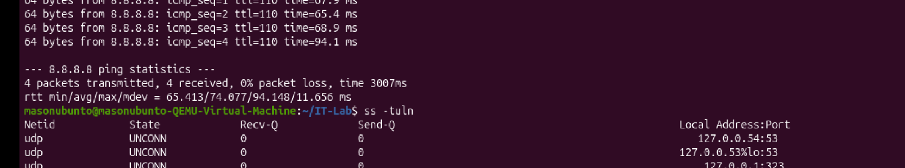
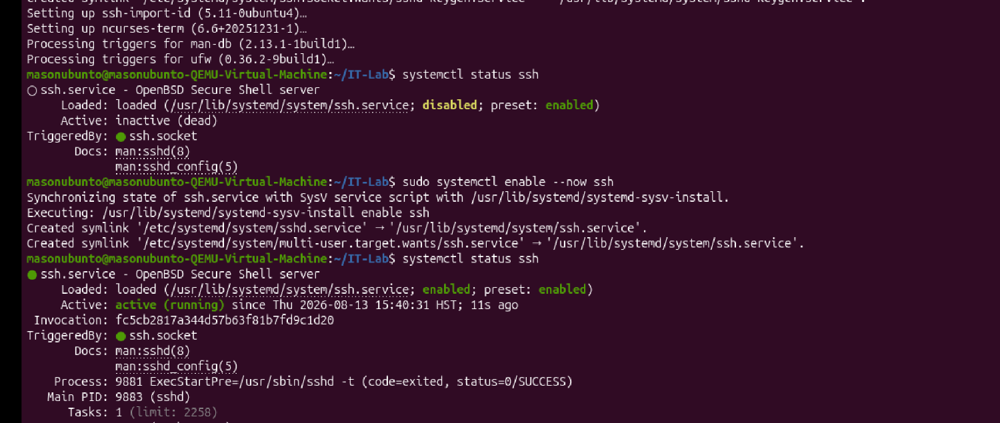
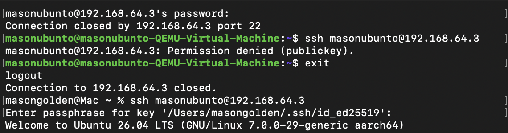
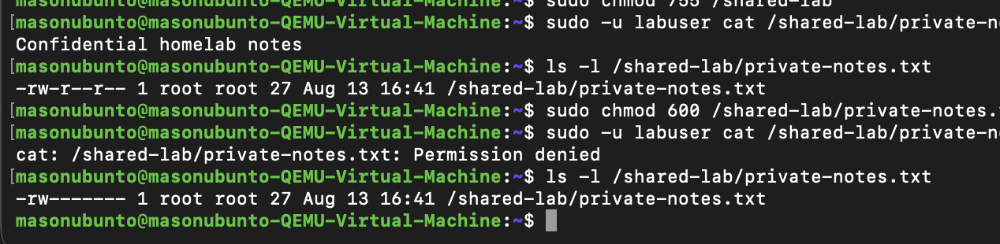
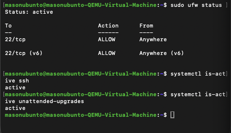
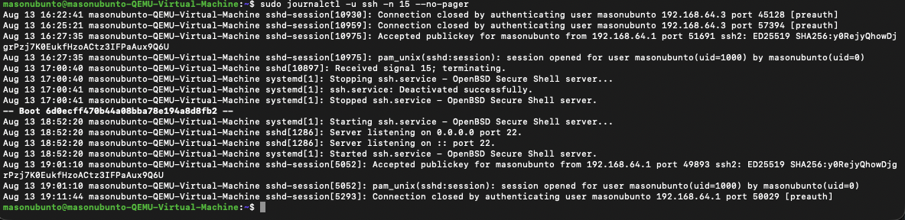
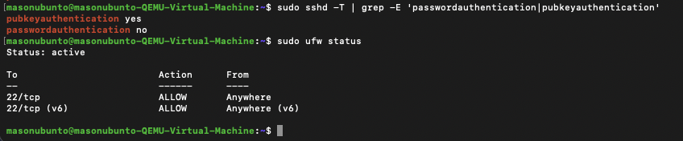

# Ubuntu Server Administration & Security Hardening Homelab

## Overview

This project documents the creation and security hardening of an Ubuntu Linux server running as a virtual machine in UTM on macOS.

The goal was to gain hands-on experience with Linux system administration, networking, remote administration, access control, firewall configuration, SSH security, patch management, and security log analysis.

Rather than only configuring the server, I established a baseline, implemented security controls, and tested those controls to verify they worked as intended.

---

## Lab Environment

- **Host:** macOS
- **Virtualization:** UTM
- **Server OS:** Ubuntu 26.04 LTS
- **Architecture:** ARM64 / aarch64
- **Remote Administration:** OpenSSH
- **Firewall:** UFW
- **Authentication:** Ed25519 SSH public/private key pair
- **Logging:** systemd journal / `journalctl`

---

## Project Objectives

- Establish a network baseline
- Identify active interfaces and listening ports
- Configure remote administration using SSH
- Implement SSH public-key authentication
- Disable SSH password authentication
- Configure a host-based firewall
- Practice Linux user and group administration
- Apply and test file permissions
- Verify automatic update functionality
- Analyze SSH authentication logs
- Validate security controls after implementation

---

## 1. Network Baseline

I began by identifying the Ubuntu server's network configuration before making security changes.

I examined the server's hostname, IP address, network interface, default gateway, routing information, connectivity, and listening TCP/UDP ports.

Commands used included:

```bash
hostname
ip addr
ip route
ping
ss -tuln
```

Establishing this baseline allowed me to understand the server's initial network exposure before enabling additional services.



---

## 2. Configuring Remote Administration with SSH

I installed OpenSSH Server so the Ubuntu VM could be remotely administered from the macOS host.

```bash
sudo apt install openssh-server
sudo systemctl enable --now ssh
systemctl status ssh
```

After enabling the service, SSH began listening on TCP port 22.



I then established a separate SSH connection from macOS to remotely administer the Ubuntu server.

---

## 3. SSH Public-Key Authentication

To improve authentication security, I generated an Ed25519 SSH public/private key pair on the Mac.

```bash
ssh-keygen -t ed25519
```

The private key remained on the Mac and was protected with a custom passphrase.

The public key was installed on the Ubuntu server, allowing the server to authenticate my Mac using public-key cryptography.

I then tested the configuration from a separate terminal session and successfully authenticated using the SSH key.



> **Security note:** Private SSH keys and passphrases should never be stored in a public GitHub repository.

---

## 4. SSH Authentication Hardening

After confirming key-based authentication worked, I hardened the SSH configuration.

The effective configuration was set to:

```text
PubkeyAuthentication yes
PasswordAuthentication no
```

I validated the SSH configuration before restarting the service:

```bash
sudo sshd -t
```

I then tested authentication from separate terminal sessions.

The tests confirmed that:

- Public-key SSH authentication succeeded.
- Password-based SSH authentication was rejected.
- Remote administration remained available after hardening.

This demonstrated the importance of testing security controls after implementing them.

---

## 5. Host Firewall Configuration

I configured Ubuntu's UFW host-based firewall.

SSH was explicitly allowed before enabling the firewall to prevent accidentally locking myself out of the server.

```bash
sudo ufw allow ssh
sudo ufw enable
sudo ufw status
```

The resulting firewall configuration allowed SSH traffic on TCP port 22.

I then established another remote connection to verify that legitimate SSH access still worked with the firewall active.

---

## 6. Linux Users & Least Privilege

I examined the primary Linux user's identity and group memberships:

```bash
id
```

I then created a separate non-administrative test account.

```bash
sudo adduser labuser
```

The secondary account was used to test access restrictions without granting it administrative privileges.

This demonstrated the **principle of least privilege**: users should receive only the access required for their role.

---

## 7. File & Directory Permissions

I created test files and used Linux permissions to restrict access to protected information.

A test file was restricted with:

```bash
chmod 600 private-notes.txt
```

Permissions of `600` produce:

```text
rw-------
```

This means:

- **Owner:** read and write
- **Group:** no permissions
- **Others:** no permissions

I then attempted to access the protected file as the secondary user.

The result was:

```text
Permission denied
```

This verified that the access-control restriction was actually enforced.



---

## 8. Updates & Patch Management

I refreshed Ubuntu's package information and reviewed available upgrades.

```bash
sudo apt update
apt list --upgradable
```

During the lab, several packages were temporarily withheld because of Ubuntu's phased-update process rather than because of a package-management failure.

I also verified the status of Ubuntu's unattended-upgrades service:

```bash
systemctl is-active unattended-upgrades
```

The service returned:

```text
active
```

This confirmed automatic update functionality was active on the system.



---

## 9. SSH Security Log Analysis

After configuring and testing SSH, I reviewed authentication and connection activity in the SSH service logs.

```bash
sudo journalctl -u ssh -n 15 --no-pager
```

The logs contained events related to:

- SSH connections
- Authentication activity
- Successful public-key authentication
- Sessions opening and closing
- SSH service activity

I also filtered the logs specifically for successful public-key authentication:

```bash
sudo journalctl -u ssh --no-pager | grep "Accepted publickey"
```

This demonstrated how Linux security logs can be searched for specific authentication events during an investigation.



---

## 10. Final Security Verification

After implementing the controls, I performed final verification rather than assuming the configuration worked.

I verified:

- UFW firewall was active
- SSH service was active
- TCP port 22 was listening
- Public-key authentication was enabled
- Password authentication was disabled
- SSH key authentication worked remotely
- Password-only SSH authentication was rejected
- File permissions prevented unauthorized access
- Unattended upgrades were active
- SSH authentication activity appeared in system logs

I checked the effective SSH configuration using:

```bash
sudo sshd -T | grep -E 'passwordauthentication|pubkeyauthentication'
```

The final configuration reported:

```text
pubkeyauthentication yes
passwordauthentication no
```



---

## Troubleshooting & Lessons Learned

### SSH configuration changes

During the project, I learned that modifying an SSH configuration file does not automatically mean the intended setting is active.

I used:

```bash
sudo sshd -T
```

to inspect the **effective SSH configuration**, corrected the configuration, validated it, restarted the service, and tested it from another connection.

### Linux directory permissions

While testing file access, I encountered a `Permission denied` result caused by directory permissions rather than only the permissions of the target file.

This demonstrated that Linux access control depends on both the target file and the permissions of the directories leading to that file.

### Ubuntu phased updates

Some available packages were not immediately upgraded.

A dry-run showed:

```text
Not upgrading yet due to phasing
```

This helped distinguish normal Ubuntu phased-update behavior from an actual package-management problem.

### Verification matters

One of the most important lessons from this project was that implementing a security control is only part of the process.

I repeatedly tested the environment from separate sessions to verify that authorized access continued to work while unauthorized access was denied.

---

## Skills Demonstrated

- Linux command-line administration
- TCP/IP networking fundamentals
- Network interfaces and routing
- TCP/UDP port analysis
- OpenSSH administration
- SSH public/private key authentication
- SSH configuration hardening
- Linux users and groups
- Least privilege
- Linux file and directory permissions
- UFW firewall administration
- Package and update management
- systemd service management
- Linux security log analysis
- `journalctl` and `grep`
- Security control testing and validation
- Troubleshooting configuration issues

---

## Security Concepts Demonstrated

- Defense in depth
- Least privilege
- Authentication hardening
- Access control
- Host-based firewalling
- Secure remote administration
- Patch management
- Security logging
- Verification and validation

---

## Lab Architecture

```text
macOS Host
    |
    | SSH
    | Public-key authentication
    v
UTM Virtual Network
    |
    v
Ubuntu Linux Server
    |
    +-- OpenSSH Server (TCP/22)
    |
    +-- UFW Firewall
    |
    +-- Linux Users / Groups
    |
    +-- File Permissions
    |
    +-- Unattended Upgrades
    |
    +-- systemd / SSH Logs
```

---

## Future Improvements

Future additions to this homelab could include:

- Restricting SSH firewall access to specific source networks
- Fail2ban
- Remote Nmap scanning from a second VM
- Vulnerability scanning
- Centralized logging with a SIEM
- Custom security alerts
- Additional Linux servers
- Network segmentation
- Active Directory integration
- Building a larger SOC-focused homelab

---

## Disclaimer

This project was completed in a personal virtualized homelab for educational purposes. All configuration changes, authentication testing, and security testing were performed against systems under my control.
